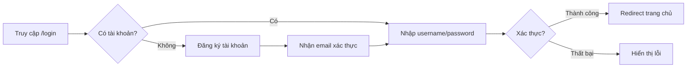
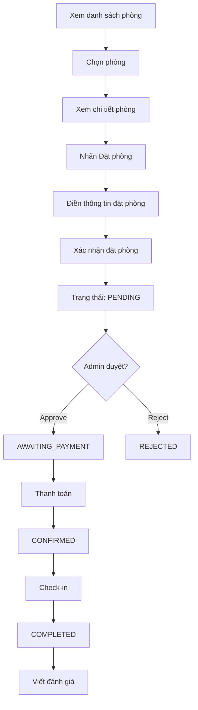
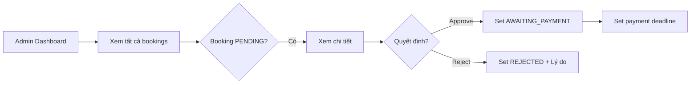
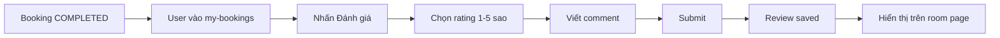

# 🏨 BÁO CÁO DỰ ÁN HOTEL BOOKING SYSTEM

## 📋 Thông Tin Tổng Quan

| Thuộc tính | Giá trị |
|------------|---------|
| **Tên dự án** | Hotel Booking System |
| **Phiên bản** | 0.0.1-SNAPSHOT |
| **Framework** | Spring Boot 3.4.1 |
| **Java Version** | 21 |
| **Database** | Microsoft SQL Server |
| **Template Engine** | Thymeleaf |
| **Build Tool** | Maven |

---

## 🏗️ Kiến Trúc Dự Án

```
hotel-develop/
├── src/main/java/com/hsf/hotel/
│   ├── HotelApplication.java          # Main entry point
│   ├── config/                         # Cấu hình
│   │   ├── SecurityConfig.java         # Spring Security
│   │   └── DataInitializer.java        # Khởi tạo dữ liệu mẫu
│   ├── controller/                     # 11 Controllers
│   ├── service/                        # 11 Services
│   ├── repository/                     # 5 Repositories
│   ├── model/                          # 7 Models/Entities
│   ├── dto/                            # 3 DTOs
│   └── scheduler/                      # Scheduled tasks
├── src/main/resources/
│   ├── templates/                      # 19 HTML templates
│   └── application.properties          # Cấu hình ứng dụng
└── pom.xml                             # Maven dependencies
```

---

## 📦 Dependencies (Thư viện sử dụng)

| Thư viện | Mục đích |
|----------|----------|
| `spring-boot-starter-web` | REST API & Web MVC |
| `spring-boot-starter-thymeleaf` | Template Engine |
| `spring-boot-starter-security` | Bảo mật, xác thực |
| `spring-boot-starter-data-jpa` | JPA/Hibernate ORM |
| `spring-boot-starter-mail` | Gửi email |
| `spring-boot-starter-webflux` | Reactive WebClient (cho AI) |
| `mssql-jdbc` | SQL Server Driver |
| `lombok` | Giảm boilerplate code |
| `poi-ooxml` | Export Excel |
| `itext7-core` | Export PDF |

---

## 🗃️ Data Models (Entities)

### 1. User (Người dùng)
- `id`, `username`, `password`, `email`, `fullName`
- `role` (USER/ADMIN)
- `avatarFilename`, `emailVerified`, `resetToken`

### 2. Room (Phòng)
- `id`, `roomNumber`, `roomType`, `pricePerNight`
- `description`, `imageUrl`, `isAvailable`

### 3. RoomType (Loại phòng) - Enum
- `STANDARD`, `DELUXE`, `SUITE`, `VIP`

### 4. Booking (Đặt phòng)
- `id`, `user`, `room`
- `checkInDate`, `checkOutDate`, `totalPrice`
- `status`, `guestName`, `guestPhone`, `notes`
- `approvedBy`, `approvedAt`, `rejectionReason`
- `paymentDeadline`, `paidAt`, `createdAt`

### 5. BookingStatus (Trạng thái đặt phòng) - Enum
| Status | Mô tả |
|--------|-------|
| `PENDING` | Chờ xác nhận |
| `AWAITING_PAYMENT` | Chờ thanh toán |
| `CONFIRMED` | Đã xác nhận |
| `REJECTED` | Bị từ chối |
| `CANCELLED` | Đã hủy |
| `COMPLETED` | Hoàn thành |

### 6. Review (Đánh giá)
- `id`, `user`, `room`, `booking`
- `rating` (1-5), `comment`, `createdAt`

### 7. ChatMessage (Tin nhắn AI)
- Dùng cho tính năng gợi ý phòng AI

---

## 🎮 Controllers & Endpoints

### 1. WebController
| Endpoint | Phương thức | Mô tả |
|----------|-------------|-------|
| `/` | GET | Trang chủ |
| `/login` | GET | Trang đăng nhập |
| `/register` | POST | Đăng ký tài khoản |
| `/logout` | GET/POST | Đăng xuất |

### 2. RoomController
| Endpoint | Phương thức | Mô tả |
|----------|-------------|-------|
| `/rooms` | GET | Danh sách phòng |
| `/room/{id}` | GET | Chi tiết phòng |
| `/search` | GET | Tìm kiếm phòng |

### 3. BookingController
| Endpoint | Phương thức | Mô tả |
|----------|-------------|-------|
| `/booking/{roomId}` | GET | Form đặt phòng |
| `/booking/{roomId}` | POST | Xác nhận đặt phòng |
| `/my-bookings` | GET | Lịch sử đặt phòng |
| `/booking/{id}/cancel` | POST | Hủy đặt phòng |
| `/booking/{id}/pay` | GET/POST | Thanh toán |

### 4. ReviewController
| Endpoint | Phương thức | Mô tả |
|----------|-------------|-------|
| `/booking/{id}/review` | GET/POST | Viết đánh giá |
| `/review/{id}/update` | POST | Cập nhật đánh giá |
| `/review/{id}/delete` | POST | Xóa đánh giá |
| `/room/{id}/reviews` | GET | Xem đánh giá phòng |
| `/my-reviews` | GET | Đánh giá của tôi |

### 5. ProfileController
| Endpoint | Phương thức | Mô tả |
|----------|-------------|-------|
| `/profile` | GET | Xem profile |
| `/profile` | POST | Cập nhật profile |
| `/change-password` | GET/POST | Đổi mật khẩu |
| `/forgot-password` | GET/POST | Quên mật khẩu |
| `/reset-password` | GET/POST | Đặt lại mật khẩu |

### 6. AdminController
| Endpoint | Phương thức | Mô tả |
|----------|-------------|-------|
| `/admin/dashboard` | GET | Dashboard admin |
| `/admin/bookings` | GET | Quản lý đặt phòng |
| `/admin/booking/{id}/approve` | POST | Duyệt đặt phòng |
| `/admin/booking/{id}/reject` | POST | Từ chối đặt phòng |
| `/admin/rooms` | GET | Quản lý phòng |
| `/admin/room/add` | POST | Thêm phòng |
| `/admin/room/{id}/edit` | POST | Sửa phòng |
| `/admin/room/{id}/delete` | POST | Xóa phòng |
| `/admin/users` | GET | Quản lý người dùng |

### 7. ReportController
| Endpoint | Phương thức | Mô tả |
|----------|-------------|-------|
| `/admin/reports/excel` | POST | Xuất báo cáo Excel |
| `/admin/reports/pdf` | POST | Xuất báo cáo PDF |

### 8. AiController
| Endpoint | Phương thức | Mô tả |
|----------|-------------|-------|
| `/ai-recommend` | GET | Trang gợi ý AI |
| `/ai/recommend` | POST | Nhận gợi ý từ AI |

---

## 🔄 CÁC WORKFLOWS CHÍNH

### 📌 Workflow 1: Đăng ký & Đăng nhập



**Flow:**
1. User truy cập `/login`
2. Nhấn "Đăng ký" nếu chưa có tài khoản
3. Điền form: username, email, password, fullName
4. Nhận email xác thực (nếu cấu hình)
5. Đăng nhập với username/password
6. Spring Security xử lý xác thực
7. Redirect về trang chủ nếu thành công

---

### 📌 Workflow 2: Đặt phòng (User)



**Flow chi tiết:**
1. **Xem phòng**: `/rooms` - Danh sách phòng có filter
2. **Chi tiết**: `/room/{id}` - Thông tin, hình ảnh, đánh giá
3. **Đặt phòng**: `/booking/{roomId}` - Form đặt phòng
4. **Xác nhận**: POST form với ngày check-in/out, thông tin khách
5. **Chờ duyệt**: Status = `PENDING`
6. **Admin duyệt**: Status = `AWAITING_PAYMENT` (có deadline)
7. **Thanh toán**: `/booking/{id}/pay` - Mô phỏng thanh toán
8. **Xác nhận**: Status = `CONFIRMED`
9. **Hoàn thành**: Status = `COMPLETED` sau check-out
10. **Đánh giá**: `/booking/{id}/review`

---

### 📌 Workflow 3: Quản lý đặt phòng (Admin)



**Flow:**
1. Admin đăng nhập
2. Truy cập `/admin/dashboard`
3. Xem danh sách bookings
4. Filter theo status: PENDING, AWAITING_PAYMENT, etc.
5. Approve: Set status = `AWAITING_PAYMENT` + deadline
6. Reject: Set status = `REJECTED` + rejection reason

---

### 📌 Workflow 4: Quản lý phòng (Admin)

**CRUD Operations:**
- **Create**: `/admin/room/add` - Thêm phòng mới
- **Read**: `/admin/rooms` - Danh sách phòng
- **Update**: `/admin/room/{id}/edit` - Sửa thông tin
- **Delete**: `/admin/room/{id}/delete` - Xóa phòng

---

### 📌 Workflow 5: Review & Rating



**Flow:**
1. Booking phải ở trạng thái `COMPLETED`
2. User truy cập `/my-bookings`
3. Nhấn nút "Đánh giá"
4. Form: Rating (1-5 sao) + Comment
5. Submit review
6. Review hiển thị trên trang chi tiết phòng
7. Tính trung bình rating cho phòng

---

### 📌 Workflow 6: Profile Management

**Chức năng:**
- Xem và cập nhật thông tin cá nhân
- Upload avatar
- Đổi mật khẩu (yêu cầu mật khẩu cũ)
- Quên mật khẩu (gửi email reset link)
- Reset mật khẩu (qua token)

---

### 📌 Workflow 7: Reporting & Analytics

**Export:**
- Excel: `/admin/reports/excel`
- PDF: `/admin/reports/pdf`

**Lọc theo:**
- Ngày bắt đầu (startDate)
- Ngày kết thúc (endDate)

---

### 📌 Workflow 8: AI Recommendation

**Tính năng:**
- Tích hợp Ollama AI (local LLM)
- Chat-based gợi ý phòng
- Phân tích nhu cầu khách hàng
- Đề xuất phòng phù hợp

---

## 🔐 Bảo mật (Security)

| Tính năng | Trạng thái |
|-----------|------------|
| CSRF Protection | ✅ Bật |
| BCrypt Password | ✅ Có |
| Form Login | ✅ Spring Security |
| Session Management | ✅ Max 1 session/user |
| Role-based Access | ✅ USER/ADMIN |
| URL Authorization | ✅ Phân quyền |

**Phân quyền URL:**
- **Public**: `/`, `/login`, `/register`, `/rooms`, `/room/**`
- **Authenticated**: `/my-bookings`, `/profile`, `/booking/**`
- **Admin only**: `/admin/**`

---

## 📧 Email Templates

| Template | Mục đích |
|----------|----------|
| `booking-confirmation.html` | Xác nhận đặt phòng |
| `booking-approved.html` | Thông báo booking được duyệt |
| `booking-rejected.html` | Thông báo booking bị từ chối |
| `payment-confirmation.html` | Xác nhận thanh toán |
| `password-reset.html` | Link đặt lại mật khẩu |
| `email-verification.html` | Xác thực email |
| `welcome.html` | Chào mừng user mới |

---

## 🖥️ Giao diện (Templates)

| Template | Mô tả |
|----------|-------|
| `index.html` | Trang chủ |
| `login.html` | Đăng nhập/Đăng ký |
| `booking.html` | Form đặt phòng |
| `my-bookings.html` | Lịch sử đặt phòng |
| `payment.html` | Thanh toán |
| `profile.html` | Thông tin cá nhân |
| `change-password.html` | Đổi mật khẩu |
| `review-form.html` | Viết đánh giá |
| `my-reviews.html` | Đánh giá của tôi |
| `room-reviews.html` | Đánh giá phòng |
| `ai-recommend.html` | Gợi ý AI |
| `admin-dashboard.html` | Dashboard admin |
| `admin-bookings.html` | Quản lý đặt phòng |
| `admin-rooms.html` | Quản lý phòng |
| `admin-users.html` | Quản lý người dùng |

---

## 📊 Thống kê dự án

| Metric | Số lượng |
|--------|----------|
| Controllers | 11 |
| Services | 11 |
| Repositories | 5 |
| Models | 7 |
| DTOs | 3 |
| HTML Templates | 19 |
| Email Templates | 7 |
| Unit Tests | Có |

---

## 🚀 Hướng dẫn chạy

```bash
# Clone project
git clone <repository-url>

# Build
mvn clean install

# Run
mvn spring-boot:run

# Truy cập
http://localhost:8080
```

**Tài khoản mặc định:**
- Admin: `admin` / `admin`
- User: `a` / `a`

---

## ✅ Tính năng đã hoàn thành

- [x] Đăng ký, Đăng nhập, Đăng xuất
- [x] Quản lý phòng (CRUD)
- [x] Đặt phòng với workflow đầy đủ
- [x] Duyệt/Từ chối đặt phòng (Admin)
- [x] Thanh toán (mô phỏng)
- [x] Review & Rating system
- [x] User Profile + Avatar
- [x] Đổi mật khẩu (BCrypt)
- [x] Quên/Reset mật khẩu (Email)
- [x] Admin Dashboard
- [x] Export báo cáo Excel/PDF
- [x] AI Recommendation (Ollama)
- [x] Email notifications
- [x] Spring Security + CSRF

---

*Báo cáo được tạo tự động vào: 2026-01-26*
