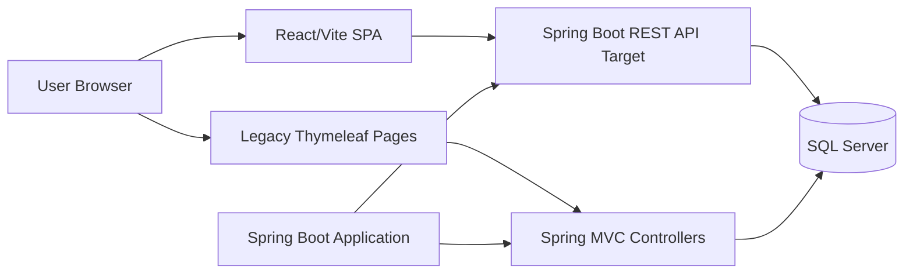
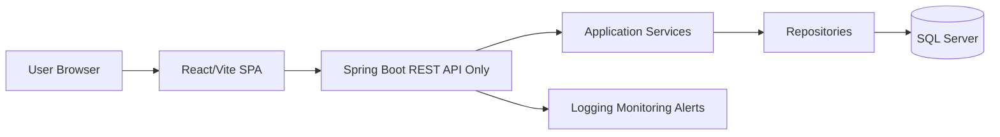

# Sprint 1.1 Repo Audit And Architecture Map

Date: 2026-06-29  
Project: Nhu Villas  
Epic: EPIC 1 - Project Governance And Architecture Baseline  
Sprint: Sprint 1.1 - Repo audit and architecture map  
Scope: Documentation only

## 1. Source Of Truth Review

Required sources:

| Source | Status | Notes |
| --- | --- | --- |
| `AI_PROJECT_FRAMEWORK` | Reviewed | Framework contains project, architecture, frontend, backend, SEO, accessibility, performance, database, Git, deployment, and review rules. |
| `LUXURY_EXPERIENCE_BLUEPRINT.md` | Missing | File is not present at repository root. This is a source-of-truth gap. |
| `UI_QUALITY_CHECKLIST.md` | Reviewed | Defines public UI quality gates: UI/UX/Luxury/Motion/Performance/Accessibility/Responsive/Conversion >=95 and SEO >=98. |
| `MASTER_PROJECT_PLAN.md` | Reviewed | Sprint 1.1 allows documentation-only audit and forbids runtime source changes. |

Conflict / blocker:

- The user requires reading `LUXURY_EXPERIENCE_BLUEPRINT.md`, but the file is missing.
- `MASTER_PROJECT_PLAN.md` already defines the fallback: use `AI_PROJECT_FRAMEWORK/00_PROJECT_RULE.md` and `UI_QUALITY_CHECKLIST.md` until the blueprint is restored.
- No code execution scope is changed by this fallback.

## 2. Sprint Scope Control

Allowed:

- Read project documentation.
- Inspect repository structure.
- Inspect frontend/backend/database surfaces.
- Produce architecture audit documentation.

Forbidden:

- Runtime source edits.
- Component creation.
- API implementation.
- Database schema changes.
- Moving to another sprint.

This sprint edits only this document.

## 3. Repository Map

Top-level structure:

| Path | Role | Current Assessment |
| --- | --- | --- |
| `AI_PROJECT_FRAMEWORK/` | Governance and engineering rules | Primary active source of truth. |
| `MASTER_PROJECT_PLAN.md` | Execution plan | Defines epic/sprint order and quality gates. |
| `UI_QUALITY_CHECKLIST.md` | UI quality gate | Defines luxury UI, UX, motion, SEO, performance, accessibility, responsive, and conversion requirements. |
| `frontend/` | React/Vite frontend | Active SPA foundation exists. Uses Vite, React, TypeScript, Tailwind, GSAP, Lenis, React Query. |
| `hotel/` | Spring Boot application | Mixed Spring Boot MVC/Thymeleaf and REST API application. Not yet REST-only. |
| `hotel/src/main/resources/templates/` | Legacy server-rendered UI | Large Thymeleaf surface remains active and must be protected until React fully replaces it. |
| `hotel/src/main/resources/static/` | Backend-served static assets | Legacy static UI assets. |
| `hotel/src/main/resources/application.properties` | Backend configuration | Contains database, JPA, email/admin, booking, and AI provider keys/settings. Secrets must be externalized before production. |
| `hotel/migration.sql`, `hotel/update_constraint.sql` | Database scripts | Existing SQL scripts. No standardized migration workflow confirmed. |
| `frontend/dist/`, `hotel/target/`, `hotel/logs/`, `hotel/uploads/` | Generated/runtime artifacts | Should be treated as build/runtime output, not product source. |

## 4. Frontend Architecture Audit

Current stack from `frontend/package.json`:

- React 19.
- React Router 7.
- TanStack React Query.
- Tailwind CSS 4.
- GSAP.
- Lenis.
- Vite.
- TypeScript.
- Oxlint.

Current frontend source map:

| Path | Role | Assessment |
| --- | --- | --- |
| `frontend/src/app/router.tsx` | Route definition | SPA routing exists for home and villas. |
| `frontend/src/shared/layouts/RootLayout.tsx` | Shared layout | Foundation for app shell. |
| `frontend/src/shared/components/` | Shared primitives | Button, Input, Card, Navbar exports exist. |
| `frontend/src/features/home/` | Feature module | Feature-based structure started. |
| `frontend/src/features/villas/` | Feature module | Villas page exists. |
| `frontend/src/components/` | Legacy/global components | Navbar/Footer remain outside shared or feature boundaries. |
| `frontend/src/sections/` | Section-level public UI | Several home/luxury sections exist outside feature modules. |
| `frontend/src/hooks/` | Animation/scroll hooks | GSAP/Lenis style hooks exist. |
| `frontend/src/assets/` | Static frontend assets | Hero and default Vite/React assets present. |

Frontend architecture gaps:

- Feature-based architecture is started but not yet consistent.
- `src/components`, `src/sections`, `src/features`, and `src/shared` coexist without a clear ownership rule.
- API layer is not fully centralized yet.
- React Query is installed but not yet confirmed as the standard for all server state.
- Error, loading, and empty state conventions are not yet centralized.
- Design system primitives exist but are still early.

## 5. Backend Architecture Audit

Current backend stack from `hotel/pom.xml`:

- Spring Boot 3.4.1.
- Java 21.
- Spring Web.
- Spring Security.
- Spring Data JPA.
- SQL Server driver.
- Thymeleaf.
- Validation.
- WebFlux.
- Mail.
- Reporting/export dependencies.

REST API surface found:

| Controller | Route | Notes |
| --- | --- | --- |
| `RoomApi` | `/api/v1/rooms` | REST-style room listing/detail API. |
| `BlogApi` | `/api/v1/blogs` | REST-style blog API. |
| `HealthApi` | `/api/v1/health` | Health endpoint. |
| `InfoApi` | `/api/v1/info/{slug}` | REST-style static info endpoint. |
| `NotificationController` | `/api/notifications` | Uses non-v1 route. |
| `UserController` | `/api/user/update` | Uses non-v1 route. |
| `BookingController` | `/api/rooms/{roomId}/booked-dates`, `/api/vouchers/validate` | API endpoints exist inside MVC controller. |

MVC/Thymeleaf surface found:

| Controller | Route Family | Notes |
| --- | --- | --- |
| `RoomController` | `/`, `/rooms`, `/rooms/{id}` | Public room pages. |
| `BookingController` | `/booking`, `/my-bookings` | Booking and customer booking pages. |
| `ReviewController` | Reviews pages/actions | Customer review workflows. |
| `WebController` | `/login`, `/register`, `/verify`, `/logout` | Authentication pages. |
| `ProfileController` | Profile/password flows | Account pages. |
| `AdminController` | `/admin/**` | Admin UI. |
| `ReportController` | `/admin/reports/**` | Export/reporting UI. |
| `AiController` | `/ai-recommend` | AI recommendation page. |
| `InfoController` | About/contact/FAQ/policy/gallery/offers/experiences | Public content pages. |
| `BlogController` | `/blogs`, `/blogs/{id}` | Blog pages. |
| `WishlistController` | `/wishlist` | Wishlist pages/actions. |
| `FileController` | `/uploads/{filename}` | Uploaded file serving. |

Backend architecture gaps:

- Target architecture says Spring Boot must be REST API only.
- Current backend still includes a large Thymeleaf MVC application.
- API versioning is inconsistent: `/api/v1/**` and `/api/**` coexist.
- Some API endpoints are embedded inside MVC controllers.
- API response envelope standard is not yet confirmed across all endpoints.
- OpenAPI contract is not confirmed.
- Security/authorization rules need a dedicated audit before React migration.

## 6. Database And Entity Audit

Current database direction:

- SQL Server is configured.
- JPA/Hibernate is active.
- Existing SQL scripts are present.
- Schema evolution workflow is not yet confirmed as Flyway/Liquibase or another controlled migration system.

Entities found:

| Entity | Table | Notes |
| --- | --- | --- |
| `User` | `Users` | Core identity/account entity. |
| `Room` | `Rooms` | Core villa/room inventory entity. |
| `RoomTypeEntity` | `RoomTypes` | Room type catalog. |
| `Amenity` | `Amenities` | Amenity catalog. |
| `Booking` | `Bookings` | Booking transaction entity. |
| `Voucher` | `Vouchers` | Discount/promotion entity. |
| `Review` | `Reviews` | Customer review entity. |
| `ChatMessage` | `ChatMessages` | Chat/AI/message history. |
| `Blog` | `blogs` | Content/blog entity. |
| `WishlistItem` | `wishlists` | Wishlist relation. |

Database architecture gaps:

- Table naming is mixed: PascalCase tables and lowercase plural tables coexist.
- Audit fields need entity-by-entity verification.
- Soft-delete policy needs confirmation for financial/history-sensitive entities.
- Index and constraint strategy needs a separate database sprint.
- Migration source of truth is not yet production-grade.

No schema changes are made in this sprint.

## 7. Current Architecture Map

Target architecture:

## 8. Current Vs Target Gap Summary

| Area | Current State | Target State | Gap Severity |
| --- | --- | --- | --- |
| Backend UI ownership | Spring Boot serves Thymeleaf and REST | Spring Boot REST API only | High |
| Frontend ownership | React SPA exists but partial | React/Vite owns all user UI | High |
| Frontend architecture | Mixed feature/shared/legacy folders | Consistent feature-based architecture | Medium |
| API routes | Mixed `/api/v1` and `/api` | Versioned `/api/v1` REST APIs | High |
| API contracts | Not fully centralized/standardized | DTO, validation, envelope, OpenAPI | High |
| Database migration | SQL scripts and JPA behavior | Controlled migrations and audited schema | High |
| SEO | Existing React SEO not fully audited | SEO score >=98 | High |
| Performance | Frontend build passes, bundle ~317 KB JS | Performance score >=95 | Medium |
| Accessibility | Needs route/component audit | WCAG AA, score >=95 | Medium |
| Motion | GSAP/Lenis present | Luxury storytelling without performance/a11y cost | Medium |
| Build tooling | Frontend build/lint pass, backend wrapper fails | Reliable CI build for FE and BE | High |

## 9. Build And Verification Baseline

Commands executed:

| Command | Location | Result | Notes |
| --- | --- | --- | --- |
| `npm.cmd run build` | `frontend/` | PASS | Vite production build completed. Output JS: 317.36 kB, gzip 100.18 kB. |
| `npm.cmd run lint` | `frontend/` | PASS | Oxlint completed with no reported issues. |
| `.\mvnw.cmd test` | `hotel/` | FAILED | Maven wrapper failed before Maven startup: `Cannot start maven from wrapper`. |
| `cmd /c mvnw.cmd test` | `hotel/` | FAILED | Same wrapper failure. |
| `mvn.cmd test` | `hotel/` | FAILED | Maven is not available on PATH. |

Backend build baseline is currently blocked by local Maven tooling/wrapper failure. This sprint does not modify build tooling because Sprint 1.1 is documentation-only.

## 10. Git And Workspace State

Root:

- Root directory is not confirmed as a single Git repository.
- `hotel/` has its own `.git` directory.

Backend workspace:

- `hotel/` contains many pre-existing modified and untracked files.
- This sprint does not revert or alter those files.

Frontend workspace:

- Frontend build generated/updated `frontend/dist/`.
- Runtime source files were not modified by Sprint 1.1.

## 11. Risk Register

| Risk | Type | Impact | Mitigation |
| --- | --- | --- | --- |
| Missing `LUXURY_EXPERIENCE_BLUEPRINT.md` | Product/UX governance | Luxury direction can drift | Restore file or formally replace it with framework/checklist rules before visual sprints. |
| Backend is not REST-only | Architecture | React migration may duplicate routes and behavior | Define API ownership and migrate route families sprint by sprint. |
| Mixed API versioning | Architecture/maintainability | Frontend API layer becomes inconsistent | Standardize all public APIs under `/api/v1`. |
| Thymeleaf pages remain active | Migration risk | Removing pages too early can break working flows | Protect legacy pages until React route, API, and tests replace them. |
| Database naming/migration inconsistency | Data risk | Production schema drift and hard rollback | Introduce controlled migration plan before schema changes. |
| Backend build cannot run locally | DevOps/quality | CI and release confidence are blocked | Add a dedicated build tooling fix sprint or include in Sprint 1.2 if approved. |
| Generated/runtime artifacts in workspace | Maintainability | Noise in review and deployment | Confirm `.gitignore` and artifact policy. |
| Secrets in application properties | Security | Credential leakage risk | Move secrets to environment variables/secret manager before production. |

## 12. Sprint Checklist

| Item | Status |
| --- | --- |
| Read `AI_PROJECT_FRAMEWORK` | DONE |
| Check `LUXURY_EXPERIENCE_BLUEPRINT.md` | DONE, missing |
| Read `UI_QUALITY_CHECKLIST.md` | DONE |
| Read `MASTER_PROJECT_PLAN.md` | DONE |
| Inventory frontend architecture | DONE |
| Inventory backend architecture | DONE |
| Inventory database/entity surface | DONE |
| Identify legacy surfaces | DONE |
| Run frontend build | DONE, PASS |
| Run frontend lint | DONE, PASS |
| Run backend test/build baseline | DONE, FAILED due Maven wrapper/tooling |
| Modify runtime source | NOT DONE, intentionally forbidden |
| Change database schema | NOT DONE, intentionally forbidden |
| Move to next sprint | NOT DONE, awaiting approval |

## 13. Self Review

What passed:

- Sprint stayed inside documentation-only scope.
- Runtime source was not modified.
- Frontend build and lint baseline are clean.
- Current architecture and target architecture gaps are documented.
- Legacy Thymeleaf dependency is explicitly identified.
- Backend build/tooling blocker is documented instead of hidden.

What failed:

- Backend build/test command cannot run through the Maven wrapper in the current environment.
- `LUXURY_EXPERIENCE_BLUEPRINT.md` is missing.

## 14. Rollback Plan

To rollback Sprint 1.1:

1. Delete or revert `SPRINT_1_1_REPO_AUDIT.md`.
2. No runtime source rollback is needed because this sprint does not modify runtime source.
3. If build artifacts changed during verification, regenerate them from source in the next accepted build step.

## 15. PASS / FAILED

Sprint deliverable status: COMPLETED  
Production quality gate status: FAILED

Reason:

- Documentation audit deliverable is complete.
- Frontend build/lint pass.
- Backend build/test baseline fails because the Maven wrapper cannot start and Maven is not available on PATH.
- Required source `LUXURY_EXPERIENCE_BLUEPRINT.md` is missing.

Decision:

- Do not merge as production-ready.
- Do not move to Sprint 1.2 until the user approves whether the next action is:
  - restore the missing blueprint,
  - fix backend build tooling,
  - or accept the documented fallback and continue with the next approved sprint.
