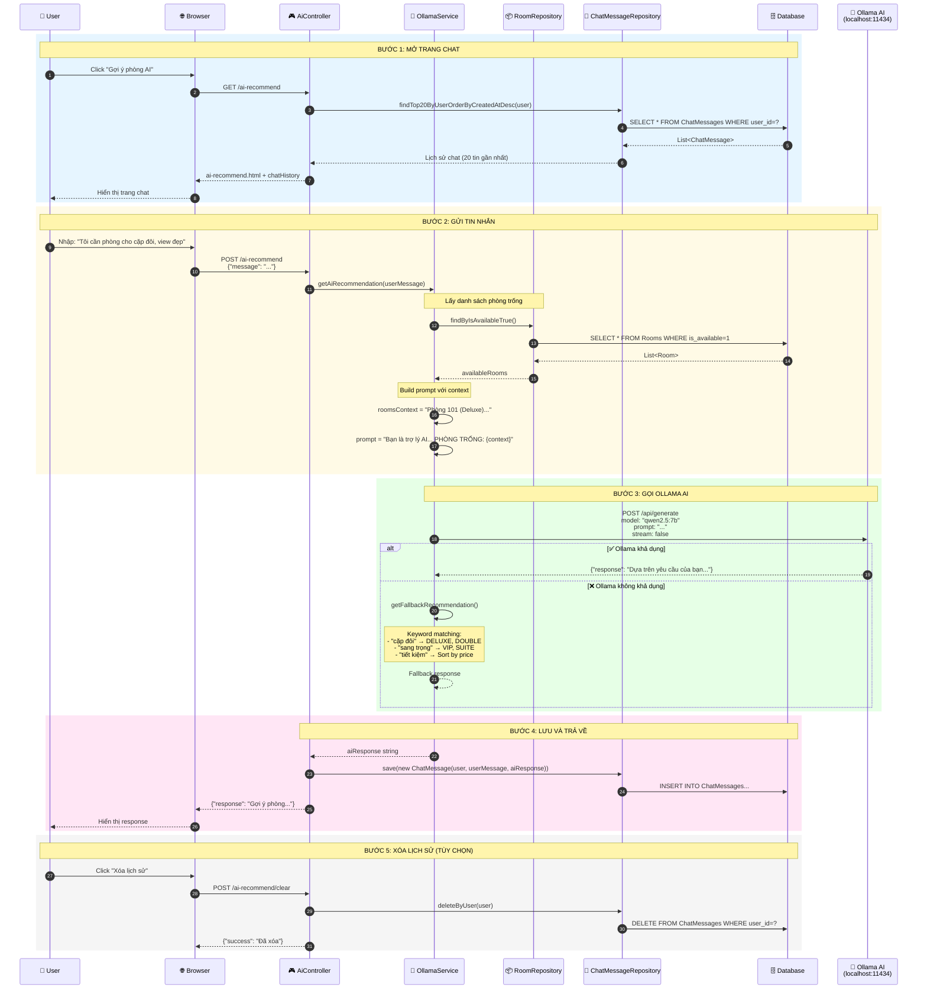
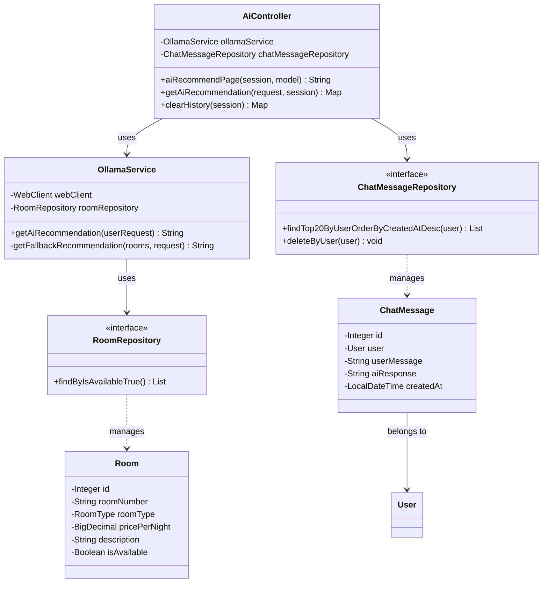
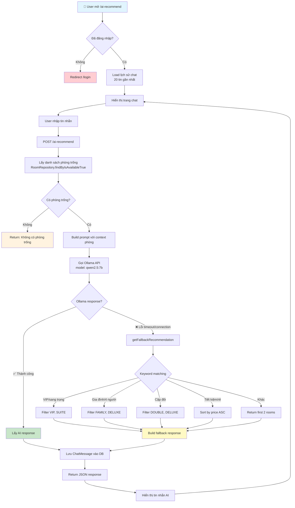

# 📊 Luồng Chat AI Recommend - Hotel Booking System

## 📌 Tổng Quan

Tính năng **AI Recommend** cho phép người dùng chat với AI để nhận gợi ý phòng phù hợp. Hệ thống sử dụng **Ollama** (model `qwen2.5:7b`) làm AI engine, với fallback logic khi AI không khả dụng.

---

## 🔄 Sequence Diagram



---

## 🏗️ Class Diagram



---

## 📈 Flowchart



---

## 📂 Các Class Liên Quan

| Class | File Path | Vai trò |
|-------|-----------|---------|
| `AiController` | `controller/AiController.java` | Xử lý HTTP request `/ai-recommend` |
| `OllamaService` | `service/OllamaService.java` | Gọi Ollama API, build prompt |
| `ChatMessage` | `model/ChatMessage.java` | Entity lưu tin nhắn |
| `ChatMessageRepository` | `repository/ChatMessageRepository.java` | CRUD tin nhắn |
| `Room` | `model/Room.java` | Entity phòng |
| `RoomRepository` | `repository/RoomRepository.java` | Query phòng trống |

---

## ⚙️ Cấu Hình

| Config | Giá trị | Mô tả |
|--------|---------|-------|
| Ollama URL | `http://localhost:11434` | Địa chỉ Ollama server |
| Model | `qwen2.5:7b` | Model AI sử dụng |
| Timeout | 120 seconds | Thời gian chờ response |
| Max history | 20 messages | Số tin nhắn lịch sử hiển thị |

---

## 🔀 Fallback Logic

Khi Ollama không khả dụng, hệ thống sử dụng **keyword matching**:

```java
if (request.contains("vip") || request.contains("sang trọng"))
    → Filter VIP, SUITE rooms
    
if (request.contains("gia đình") || request.contains("4 người"))
    → Filter FAMILY, DELUXE rooms
    
if (request.contains("cặp đôi") || request.contains("lãng mạn"))
    → Filter DOUBLE, DELUXE rooms
    
if (request.contains("rẻ") || request.contains("tiết kiệm"))
    → Sort by price ascending
    
default → Return first 2 available rooms
```
